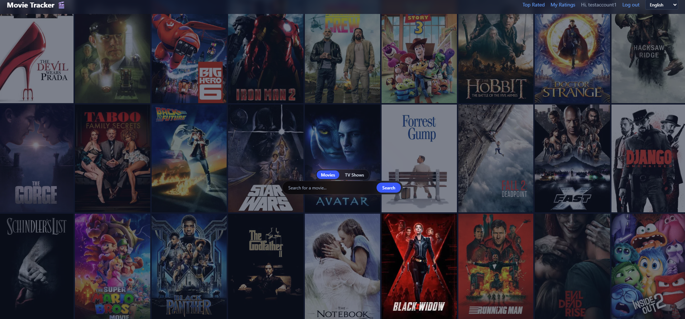
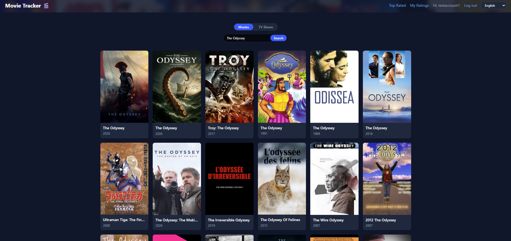
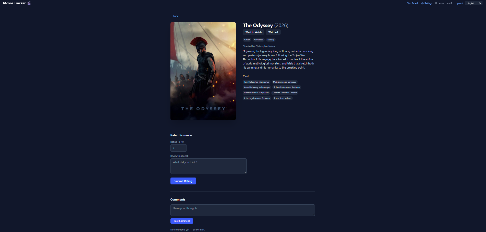

# Movie Tracker 🎬


A full-stack movie and TV show tracking application where users can search for content, rate what they've watched, track their personal watchlist, discuss titles with other users, and discover top-rated content — all powered by real data from TMDb.

## Screenshots

### Homepage


### Search


### Movie Detail


## Table of Contents

- [Features](#features)
- [Tech Stack](#tech-stack)
- [Architecture Highlights](#architecture-highlights)
- [Getting Started](#getting-started)
- [Project Structure](#project-structure)
- [Roadmap](#roadmap)

## Features

- **Search & Browse** — Search movies and TV shows via TMDb, with an animated poster backdrop homepage
- **Auth** — Secure signup/login with JWT tokens and bcrypt password hashing
- **Ratings** — Rate movies and shows (0–10), with optional written reviews
- **Watch Status** — Track titles as "Want to Watch" or "Watched"
- **Comments** — Leave comments on any movie or show, with live translation
- **Top Rated Insights** — Bayesian-weighted rankings of top movies, shows, actors, and directors, computed from real user ratings
- **Multi-language UI** — Full interface translation across 10 languages (English, Albanian, Spanish, French, German, Italian, Portuguese, Japanese, Korean, Chinese)
- **My Ratings** — Personal history of everything you've rated

## Tech Stack

**Backend**
- FastAPI (Python)
- PostgreSQL (via Docker)
- SQLAlchemy + Alembic (ORM & migrations)
- JWT authentication with bcrypt password hashing
- TMDb API integration
- MyMemory API for content translation

**Frontend**
- React + Vite
- Tailwind CSS v4
- react-i18next (internationalization)
- React Router
- Axios

## Architecture Highlights

- **Polymorphic ratings/comments/watch-status schema** — movies and TV shows share the same rating, comment, and watch-status tables via nullable foreign keys with database-level check constraints, avoiding data duplication across content types
- **Bayesian-weighted rankings** — "Top Rated" leaderboards use a weighted average formula (similar to IMDb's approach) with a minimum-ratings threshold, so a single high rating can't dominate the rankings
- **Deduplicated content ingestion** — movies and shows are looked up by TMDb ID before insertion, preventing duplicate database entries when multiple users search for the same title
- **Live content translation** — movie/show overviews and user comments translate automatically when the UI language is switched, without needing pre-translated data stored

## Getting Started

### Prerequisites
- Python 3.11+
- Node.js 20+
- Docker Desktop
- A [TMDb API key](https://www.themoviedb.org/settings/api) (free)

### Backend Setup

```bash
cd backend
python -m venv venv
venv\Scripts\Activate.ps1   # Windows PowerShell
pip install -r requirements.txt
```

Create a `.env` file in `backend/`: